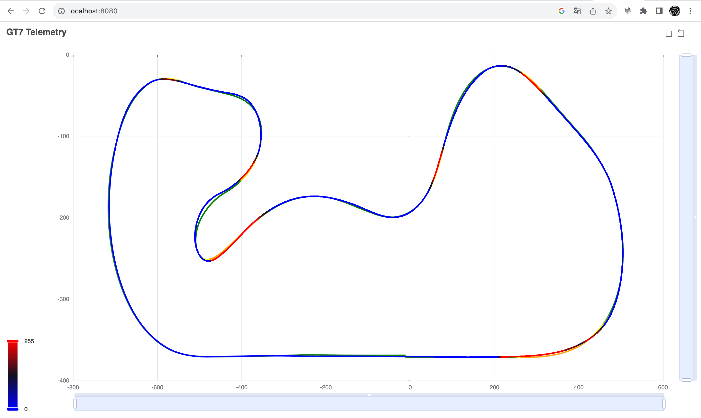

# gt7

Gran Turismo 7 Telemetry recoder and analyzer.

**WIP**

## How it works

1. Launch python recoder on any machine on your LAN.
2. Use ./gt7 CLI command on 2 files to compare (analyser done in Go).
3. Browse localhost:8080 to see trajectories and breaking intensity.

## Record

Find your PS5 IP or name on your LAN (PS5-89A73E for me) and launch as a background task:

```bash
nohup python gt7racedata.py PS5-89A73E &>gt7racedata.log &
```
It's listening for ever data from GT7 and create on file per lap sequences.
Each file is named with the fallowing convention using now time:
`YYYYmmddTHHMMSS.gt7` for example `20230728T172407.gt7`

## Analyze

Complile Go `gt7` command line with:
```bash
go build
```

Then launch analysis and graph on 2 files like:

```bash
./gt7 -file1 file1.gt7 -file2 file2.gt7
```

Then use a browser and look at `localhost:8080`.

Here is an example on Blue Moon Bay Speedway - Central A:
